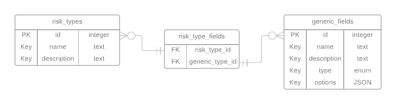

# Notes

## Requirements

- Problem:
  - Insurers:
    - Generic relationships. No database tables for each risk type.
    - Define their custom data model for risks
    - Create risk types
    - Attach as many fields as they like
  - Sample fields: first name, age, zip code, model, serial number, price
  - Field types: text, date, number, currency, enum,

- Deliverables:
  - Details
    - Host live instance
      - Bonus points for AWS with CloudFormation
      - Mega bonus points for AWS Lambda with Zappa
    - Send github repo to phil@britecore.com
  - Data:
    - Python file containing ORM classes
    - An entity-relationship diagram
  - Backend
    - Two endpoints (REST API)
      - Return a single risk type
      - List of all risk types (all data for each)
      - Tests
  - Frontend
    - Single page
    - Display field types in a form (show all fields types)
    - Fields should be appropriate widgets
    - Use ES6
    - Use Vue.js for bonus points

## Schema

The database schema is made up two Models:

1. RiskType (`risk_types` table):

Holds the specifications for a type of risk. An instance can have 0 or many
fields attached to it.

2. GenericField (`generic_fields` table)

Holds a field that may be added to 0 or many risk types. Something noteworthy is
that the `options` field which is JSON field. Currently it only holds the
choices an `enum`-typed field may have, but can potentially be used to hold
extra parameters about a field (e.g. min/max for numeric fields, formatting
restrictions for text fields, etc).

The intermediary table (`risk_type_fields`) links both models in a many-to-many
relationship.



Note: field types could potentially have their own table as well to allow new
types to be added easily. However, these types are primitive data types which
don't allow for much growth. IMO its more convenient to have only the basic
types and add range and format validations via the `options` in the
`GenericField` model.


## API

### Single Risk Type `(/risk-types/:id)`

- Supported Methods: [GET]
- Description: Retrieves a single risk type specification.
- Example Response:

```
{
  "id": 1,
  "name": "Car Risk",
  "description": "Risk model used for evaluating car insurance.",
  "fields": [
    {
      "id": 1,
      "name": "Model",
      "description": "The model of car.",
      "options": {},
      "type": "text"
    },
    {
      "id": 2,
      "name": "Date of manufacture",
      "description": "When was the car manufactured.",
      "options": {},
      "type": "date"
    },
    {
      "id": 3,
      "name": "Color",
      "description": "The color of the car",
      "options": {
        "choices": [
          "Red",
          "Green",
          "Blue",
          "Black"
        ]
      },
      "type": "enum"
    },
    {
      "id": 4,
      "name": "Mileage",
      "description": "How many miles are shown in the Odometer.",
      "options": {},
      "type": "number"
    }
  ]
}
```

### Multiple Risk Types `(/risk-types)`

- Supported Methods: [GET]
- Description: Retrieves a list of all the risk type specification.
- Example Response:

```
[
  {
    "id": 1,
    "name": "Car Risk",
    "description": "Risk model used for evaluating car insurance.",
    "fields": [ ... ],
  },
  {
    "id": 2,
    "name": "Price Insurance Risk",
    "description": "Model used for evaluating risks associated with price insurance.",
    "fields": [ ... ],
  },
  ...
]
```

## Local development

### Backend

0. Go to the `backend` folder
1. Create a virtualenv and activate it
2. Install `requirements.txt`
3. Create the database tables
```
FLASK_APP_SETTINGS_NAME=local python syncdb.py
```
4. Run the app via:
```
FLASK_APP_SETTINGS_NAME=local python run.py
```

### Frontend

0. Go to the `frontend` folder
1. Run the development server
```
yarn run dev
```

## Deployment to AWS

The application is comprised of two parts. The backend is a Flask app and the
frontend is a Vuejs SPA. The former can be deployed to AWS Lambda via Zappa,
while the latter can be served via S3.

### Setup Flask app with Zappa on AWS Lambda

0. Move to the `backend` directory.

1. Deploy Flask project to AWS lambda

```
zappa deploy dev
```

Response contains something like:

```
# ...
Deployment complete!: https://u9hhr6ktg1.execute-api.us-east-1.amazonaws.com/dev
# ...
```

Take note of this URL.

2. Initialize the database with the demo data:

```
zappa invoke dev demo_fixtures.create_demo_data
```

### Serve static SPA on S3

0. Move to the `frontend` directory.

1. Build the frontend (note we're using the URL from the backend's deploy step to tell the frontend where to send the API requests)

```
API_BASE_URL='https://u9hhr6ktg1.execute-api.us-east-1.amazonaws.com/dev' yarn run build --report
```

2. Create bucket to host static files:

```
aws s3api create-bucket --bucket britecore-interview-kirbuchi --acl public-read
```

3. Allow it to serve a website:

```
aws s3 website s3://britecore-interview-kirbuchi/ --index-document index.html --error-document error.html
```

4. Sync files from the `frontend/dist` folder:

```
aws s3 sync dist s3://britecore-interview-kirbuchi --acl "public-read"
```
